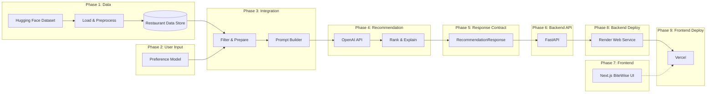

# Phase-Wise Architecture: AI-Powered Restaurant Recommendation System

This document describes the phased architecture for the Zomato-inspired recommendation system defined in [Problemstatment.md](./Problemstatment.md).

## High-Level Architecture



**Core principle:** Structured data handles filtering and constraints; the LLM handles ranking, reasoning, and natural-language explanations.

---

## Phase Overview

| Phase | Name | Primary goal | Key deliverable |
|-------|------|--------------|-----------------|
| 1 | Data Ingestion | Reliable restaurant dataset | Clean, queryable restaurant records |
| 2 | User Input | Capture preferences | Validated preference payload |
| 3 | Integration Layer | Bridge data and LLM | Filtered candidates + prompt |
| 4 | Recommendation Engine | Rank and explain | Ranked list with justifications |
| 5 | Response Contract | Standardize API payloads | `RecommendationResponse` schema |
| 6 | Backend API | Expose recommendation service | FastAPI REST API for the frontend |
| 7 | Frontend | Deliver BiteWise UI | Next.js app matching Stitch mockups |
| 8 | Backend Deployment | Host API in production | FastAPI live on **Render** |
| 9 | Frontend Deployment | Host UI in production | Next.js live on **Vercel** |

---

## Phase 1: Data Ingestion

### Goal

Load, clean, and normalize the Zomato dataset so downstream phases can filter and recommend reliably.

### Components

| Component | Responsibility |
|-----------|----------------|
| **Dataset Loader** | Fetch data from [ManikaSaini/zomato-restaurant-recommendation](https://huggingface.co/datasets/ManikaSaini/zomato-restaurant-recommendation) |
| **Preprocessor** | Handle missing values, normalize text, standardize cost/rating formats |
| **Schema Mapper** | Map raw fields to a consistent internal model |
| **Data Store** | In-memory DataFrame, CSV/Parquet file, or lightweight DB for queries |

### Data Model (minimum fields)

```text
Restaurant {
  id: string
  name: string
  location: string          // city / locality
  cuisines: string[]        // e.g. ["Italian", "Pizza"]
  cost_for_two: number      // or budget tier: low | medium | high
  rating: float             // e.g. 4.2
  address?: string
  votes?: number
}
```

### Inputs & Outputs

- **Input:** Raw Hugging Face dataset
- **Output:** Preprocessed restaurant collection ready for filtering

### Exit criteria

- [ ] Dataset loads without manual fixes
- [ ] Required fields (name, location, cuisine, cost, rating) are populated or defaulted
- [ ] Data can be queried by location, cuisine, budget, and rating

---

## Phase 2: User Input

### Goal

Collect and validate user preferences in a consistent format for the integration layer.

### Components

| Component | Responsibility |
|-----------|----------------|
| **Input Form / API** | Accept user preferences (web UI, CLI, or REST endpoint) |
| **Validator** | Enforce required fields and allowed values |
| **Preference Model** | Normalize input into a structured request object |

### Preference Schema

```text
UserPreferences {
  location: string              // e.g. "Bangalore"
  budget: "low" | "medium" | "high"
  cuisine: string               // e.g. "Chinese"
  min_rating: float             // e.g. 4.0
  additional_notes?: string     // e.g. "family-friendly, quick service"
}
```

### Inputs & Outputs

- **Input:** User selections and free-text notes
- **Output:** Validated `UserPreferences` object

### Exit criteria

- [ ] All preference fields from the problem statement are supported
- [ ] Invalid or empty inputs return clear errors
- [ ] Output schema is stable for Phase 3

---

## Phase 3: Integration Layer

### Goal

Filter restaurant data by user preferences and prepare a concise, LLM-ready context.

### Components

| Component | Responsibility |
|-----------|----------------|
| **Filter Service** | Apply hard filters (location, cuisine, min rating, budget) |
| **Candidate Selector** | Return top N candidates (e.g. 15–30) to stay within token limits |
| **Prompt Builder** | Assemble system + user prompts with preferences and candidate JSON |
| **Context Formatter** | Serialize restaurants into a compact, readable structure |

### Processing Flow

```text
UserPreferences + Restaurant Data Store
        │
        ▼
   Hard filters (location, cuisine, rating, budget)
        │
        ▼
   Candidate shortlist (top N by rating / relevance)
        │
        ▼
   Prompt = preferences + candidate list + ranking instructions
```

### Prompt Design (guidelines)

- State the user's goals explicitly (location, budget, cuisine, rating, notes)
- Provide candidate restaurants as structured JSON or a table
- Ask the LLM to rank, explain each pick, and optionally summarize trade-offs
- Request a fixed output format (e.g. JSON array) for reliable parsing

### Inputs & Outputs

- **Input:** `UserPreferences`, preprocessed restaurant data
- **Output:** Filtered candidates + final LLM prompt

### Exit criteria

- [ ] Filters reduce the dataset meaningfully without dropping all results
- [ ] Prompt stays within model context limits
- [ ] Prompt instructions produce parseable LLM responses

---

## Phase 4: Recommendation Engine

### Goal

Use **OpenAI** to rank restaurants and generate human-like explanations.

### LLM Provider

| Setting | Value |
|---------|--------|
| **Provider** | OpenAI |
| **Python SDK** | `openai` |
| **API key** | `OPENAI_API_KEY` in `.env` |
| **Default model** | `gpt-4o-mini` (cost-effective; override via `OPENAI_MODEL`) |
| **Response format** | JSON object matching `RecommendationResponse` schema |

The Phase 4 client should call the OpenAI Chat Completions API with the system and user prompts produced by Phase 3. Use `response_format={"type": "json_object"}` (or equivalent) where supported to improve parse reliability.

### Components

| Component | Responsibility |
|-----------|----------------|
| **OpenAI Client** | Call OpenAI Chat Completions API with Phase 3 prompts |
| **Response Parser** | Extract ranked list, scores, and explanations from OpenAI JSON output |
| **Fallback Ranker** | Rule-based ranking if OpenAI fails or times out |
| **Recommendation Model** | Unified structure for each suggested restaurant |

### Recommendation Output Schema

```text
Recommendation {
  rank: number
  restaurant_id: string
  name: string
  cuisine: string
  rating: float
  estimated_cost: string | number
  explanation: string           // why this fits the user
}

RecommendationResponse {
  summary?: string              // optional overview of top picks
  recommendations: Recommendation[]
}
```

### LLM Responsibilities

| Task | Owner |
|------|--------|
| Location / cuisine / rating filtering | Integration Layer (deterministic) |
| Budget matching | Integration Layer + OpenAI nuance |
| Ranking by overall fit | OpenAI |
| Natural-language explanations | OpenAI |
| Optional summary of choices | OpenAI |

### Inputs & Outputs

- **Input:** LLM prompt from Phase 3
- **Output:** `RecommendationResponse` with ranked, explained results from OpenAI

### Exit criteria

- [ ] Top 3–5 recommendations returned per request via OpenAI
- [ ] Each item includes name, cuisine, rating, cost, and explanation
- [ ] Parser handles malformed OpenAI output gracefully
- [ ] Fallback ranker runs when the OpenAI API is unavailable

---

## Phase 5: Response Contract

### Goal

Define the shared data contract between the recommendation engine (Phase 4) and the application layers (Phases 6–7) so the backend and frontend agree on shape, fields, and error formats.

### Display fields (per problem statement)

| Field | Source |
|-------|--------|
| Restaurant name | Dataset |
| Cuisine | Dataset |
| Rating | Dataset |
| Estimated cost | Dataset |
| AI-generated explanation | OpenAI (Phase 4) |
| AI summary | OpenAI (Phase 4) |

### API response schema

```text
Recommendation {
  rank: number
  restaurant_id: string
  name: string
  cuisine: string
  rating: float
  estimated_cost: string | number
  explanation: string
}

RecommendationResponse {
  summary?: string
  recommendations: Recommendation[]
  source: "openai" | "fallback"
  preferences?: UserPreferences
  total_matches?: number
}

ErrorResponse {
  message: string
  code: "validation_error" | "no_matches" | "openai_error" | "server_error"
  details?: object
}
```

### Suggested card layout (reference)

```text
┌─────────────────────────────────────────────┐
│  Your preferences: Bangalore · Chinese · ₹₹  │
├─────────────────────────────────────────────┤
│  Summary: "Three strong options near you…"   │
├─────────────────────────────────────────────┤
│  #1  Restaurant A    ★ 4.5   ₹₹           │
│      Chinese · "Great for families…"         │
├─────────────────────────────────────────────┤
│  #2  Restaurant B    ★ 4.3   ₹               │
│      Chinese · "Budget-friendly and fast…"   │
└─────────────────────────────────────────────┘
```

### Exit criteria

- [ ] `RecommendationResponse` schema is documented and stable
- [ ] Error codes cover validation, empty results, and OpenAI failures
- [ ] Backend (Phase 6) and frontend (Phase 7) both consume this contract

---

## Phase 6: Backend API

### Goal

Expose Phases 1–4 as a unified **FastAPI** REST service that the Next.js frontend (Phase 7) calls for recommendations, health checks, and restaurant details.

### Technology

| Setting | Value |
|---------|--------|
| **Framework** | FastAPI |
| **Language** | Python 3.11+ |
| **Server** | Uvicorn |
| **CORS** | Enabled for Next.js origin (`http://localhost:3000`) |
| **Config** | `.env` — `OPENAI_API_KEY`, `OPENAI_MODEL`, data path |

### Components

| Component | Responsibility |
|-----------|----------------|
| **API Router** | Define REST endpoints and request/response models |
| **Recommendation Service** | Orchestrate Phase 2 validation → Phase 3 integration → Phase 4 OpenAI |
| **Restaurant Service** | Lookup restaurant details by ID from Phase 1 data store |
| **Error Handler** | Map exceptions to `ErrorResponse` with correct HTTP status codes |
| **CORS Middleware** | Allow Next.js frontend to call the API |

### API endpoints

| Method | Path | Description |
|--------|------|-------------|
| `GET` | `/health` | Service health check |
| `POST` | `/api/recommendations` | Submit preferences, return `RecommendationResponse` |
| `GET` | `/api/restaurants/{id}` | Restaurant detail for the detail panel |
| `GET` | `/api/search/history` | Recent searches (optional, session or DB) |

### Request / response example

**POST `/api/recommendations`**

```json
{
  "location": "Bangalore",
  "cuisine": "Chinese",
  "budget": "medium",
  "min_rating": 4.0,
  "additional_notes": "family-friendly, quick service"
}
```

**Response `200`**

```json
{
  "summary": "Three strong Chinese options in Bangalore…",
  "recommendations": [
    {
      "rank": 1,
      "restaurant_id": "95df78b0ebc1e43b",
      "name": "ECHOES Koramangala",
      "cuisine": "Chinese",
      "rating": 4.7,
      "estimated_cost": 750,
      "explanation": "Great for groups and families…"
    }
  ],
  "source": "openai",
  "total_matches": 1311
}
```

### Processing flow

```text
Next.js POST /api/recommendations
        │
        ▼
   Validate preferences (Phase 2)
        │
        ▼
   Filter + build prompt (Phase 3)
        │
        ▼
   OpenAI rank + explain (Phase 4)
        │
        ▼
   Return RecommendationResponse (Phase 5 schema)
```

### Exit criteria

- [ ] `POST /api/recommendations` returns ranked results end-to-end
- [ ] Validation errors return `422` with clear field messages
- [ ] OpenAI failures trigger fallback ranking and `source: "fallback"`
- [ ] Empty filter results return `404` or `200` with `no_matches` error code
- [ ] CORS configured for local Next.js development
- [ ] API documented via FastAPI `/docs` (Swagger)

### Folder (planned)

```text
phase6_backend_api/
├── main.py
├── requirements.txt
├── src/
│   ├── api/routes.py
│   ├── services/recommendation_service.py
│   └── models/schemas.py
└── .env
```

---

## Phase 7: Frontend (Next.js — BiteWise UI)

### Goal

Build the **BiteWise AI Concierge** web application in **Next.js**, matching the Google Stitch UI mockups: sidebar navigation, preference search, AI loading state, curated results, restaurant detail panel, empty state, and error state.

### Technology

| Setting | Value |
|---------|--------|
| **Framework** | Next.js (App Router) |
| **Language** | TypeScript |
| **Styling** | Tailwind CSS |
| **Icons** | Lucide React (or similar) |
| **Data fetching** | Server Actions + `fetch` to Phase 6 FastAPI |
| **Deployment** | Vercel |

### Design system (from Stitch mockups)

| Token | Value |
|-------|--------|
| **Brand name** | BiteWise AI Concierge |
| **Primary red** | `#C1121F` / `#E23744` |
| **Background** | `#F8F8F8` (page), `#FFFFFF` (cards) |
| **Text** | `#1C1C1C` (headings), `#6B7280` (body) |
| **AI accent** | Light pink `#FFF0F0` (summary cards), light green `#ECFDF5` (AI tips) |
| **Typography** | Sans-serif (Inter / Poppins); serif logo wordmark |
| **Radius** | 12–16px on cards and buttons |
| **Layout** | Fixed left sidebar (240px) + main content + optional right widgets |

### Global layout

```text
┌──────────────┬────────────────────────────────────────────┐
│  Sidebar     │  Top bar (location, notifications, avatar) │
│              ├────────────────────────────────────────────┤
│  BiteWise    │                                            │
│  AI Concierge│           Main content area                │
│              │                                            │
│  • Home      │                                            │
│  • New Search│                                            │
│  • History   │                                            │
│  • Profile   │                                            │
│              │                                            │
│  [Upgrade]   │                                            │
│  [User card] │                                            │
└──────────────┴────────────────────────────────────────────┘
```

### Screens (match Stitch mockups)

#### Screen 1 — Landing page

| Item | Detail |
|------|--------|
| **Route** | `app/page.tsx` |
| **Purpose** | Marketing entry, drive users to search |
| **Key elements** | Hero: "Find your perfect meal, powered by AI"; primary CTA "Get Recommendations"; secondary "View AI Analysis"; feature chips (Smart filters, AI explanations, Top-rated picks); "Why BiteWise?" bento grid; newsletter section; footer |

#### Screen 2 — Preference search ("Curate Your Experience")

| Item | Detail |
|------|--------|
| **Route** | `app/search/page.tsx` |
| **Purpose** | Collect user preferences (Phase 2 fields) |
| **Key elements** | Location input (Bangalore); cuisine dropdown (Chinese); budget segmented control (`$` / `$$` / `$$$`); minimum rating slider (3.0–5.0, default 4.0+); AI personalization notes textarea; primary CTA "Find restaurants"; right column widgets: AI Tip card, Featured restaurant, "Why Bangalore?" info, Recent searches list |
| **Active nav** | "New Search" highlighted in sidebar |

#### Screen 3 — AI loading state

| Item | Detail |
|------|--------|
| **Route** | `app/search/loading.tsx` |
| **Purpose** | Show progress while Phase 6 API processes |
| **Key elements** | Centered logo; headline "Finding the best spots for you…"; 3-step progress list (Filtering → Matching taste profile → AI ranking); skeleton restaurant card placeholders |

#### Screen 4 — Results ("Curated for You")

| Item | Detail |
|------|--------|
| **Route** | `app/results/page.tsx` |
| **Purpose** | Display Phase 4/5 recommendations |
| **Key elements** | Filter chips (location, cuisine, budget); "Start new search" button; pink AI Recommendation Summary card; ranked restaurant cards: **#1 featured large card** (image, rating, cuisines, AI analysis, "Book a Table"); **#2 medium card** (rooftop/bar style, "View Details"); **#3 horizontal list card** (compact row, "View Menu" / "Book Now"); footer: "Showing N AI-curated results" + Share / View on Map |
| **Data** | `RecommendationResponse` from `POST /api/recommendations` |

#### Screen 5 — Restaurant detail panel

| Item | Detail |
|------|--------|
| **Route** | `app/results/[id]/page.tsx` or slide-over panel |
| **Purpose** | Expanded view for a single restaurant |
| **Key elements** | Cuisine tags (Chinese, American, Casual Dining); open hours; "Why we recommend this" teal AI box with explanation; "Must Try" and "Perfect For" quick-info cards; address with map pin; CTAs: "Open in Maps", "Call Now", "Share"; "Top Dishes" horizontal scroll with photos and prices (₹) |

#### Screen 6 — Empty state (no matches)

| Item | Detail |
|------|--------|
| **Route** | `app/results/page.tsx` (conditional) |
| **Purpose** | Shown when filters return zero restaurants |
| **Key elements** | Illustration (magnifying glass + fork + X); "No matches found" heading; explanation text; removable filter pills; primary "Edit preferences"; secondary "Clear all filters"; green AI Tip: "Expanding your radius might reveal more options" |

#### Screen 7 — Error state (OpenAI / API failure)

| Item | Detail |
|------|--------|
| **Route** | `app/error.tsx` |
| **Purpose** | Shown when recommendation API or OpenAI fails |
| **Key elements** | Cloud-with-slash icon; "Couldn't get AI recommendations" heading; reassuring body copy; primary "Try again"; secondary "View fallback results"; "What happens next?" info card with skeleton listing previews; "Check system status" link |

### Component map

| Component | Used on |
|-----------|---------|
| `Sidebar` | All authenticated layouts |
| `TopBar` | Search, results, loading |
| `PreferenceForm` | Search page |
| `BudgetSelector` | Search page |
| `RatingSlider` | Search page |
| `AITipCard` | Search, empty state |
| `AISummaryBanner` | Results page |
| `RestaurantCardFeatured` | Results #1 |
| `RestaurantCardMedium` | Results #2 |
| `RestaurantCardCompact` | Results #3+ |
| `RestaurantDetailPanel` | Detail route |
| `EmptyState` | Results (no data) |
| `ErrorState` | Global error boundary |
| `LoadingProgress` | Search loading |

### Routes summary

| Route | Screen |
|-------|--------|
| `/` | Landing |
| `/search` | Preference form |
| `/search/loading` | AI processing |
| `/results` | Curated recommendations |
| `/results/[id]` | Restaurant detail |
| `error.tsx` | API / OpenAI failure |

### Data flow

```text
User fills form on /search
        │
        ▼
Next.js POST → Phase 6 /api/recommendations
        │
        ▼
Navigate to /results with response data
        │
        ▼
Render AI summary + ranked cards
        │
        ▼
Click card → /results/[id] detail panel
```

### Exit criteria

- [ ] All 7 Stitch screens implemented with matching layout and design tokens
- [ ] Sidebar navigation works across pages (active state on current route)
- [ ] Preference form submits to Phase 6 API and navigates to results
- [ ] Results page renders AI summary and 3–5 ranked cards with explanations
- [ ] Loading, empty, and error states match mockups
- [ ] Restaurant detail panel shows full metadata and CTAs
- [ ] Responsive: sidebar collapses to mobile drawer on small screens

### Folder (planned)

```text
phase7_frontend/
├── app/
│   ├── layout.tsx          # Sidebar + shell
│   ├── page.tsx            # Landing
│   ├── search/
│   │   ├── page.tsx
│   │   └── loading.tsx
│   ├── results/
│   │   ├── page.tsx
│   │   └── [id]/page.tsx
│   └── error.tsx
├── components/
│   ├── layout/Sidebar.tsx
│   ├── search/PreferenceForm.tsx
│   └── results/RestaurantCard*.tsx
├── lib/api.ts              # Phase 6 client
└── package.json
```

### Reference mockups

UI designs were generated in Google Stitch — see [GoogleStitchUIPrompts.md](./GoogleStitchUIPrompts.md). Phase 7 implementation should match those screens: red sidebar accent, coral CTAs, AI summary pink card, green AI tip boxes, and ranked restaurant cards with photos.

---

## Phase 8: Backend Deployment (Render)

### Goal

Deploy the Phase 6 FastAPI backend as a production **Render Web Service** so the recommendation API is publicly reachable by the Vercel-hosted frontend.

### Platform

| Setting | Value |
|---------|--------|
| **Platform** | [Render](https://render.com) |
| **Service type** | Web Service |
| **Runtime** | Python 3.11+ |
| **Root directory** | `phase6_backend_api` |
| **Build command** | `pip install -r requirements.txt` |
| **Start command** | `uvicorn backend.api.app:app --host 0.0.0.0 --port $PORT` |
| **Health check** | `GET /health` |

### Environment variables (Render dashboard)

| Variable | Description | Example |
|----------|-------------|---------|
| `OPENAI_API_KEY` | OpenAI API key for Phase 4 | `sk-...` |
| `OPENAI_MODEL` | Model name | `gpt-4o-mini` |
| `DATA_PATH` | Path to processed restaurant parquet | `../phase1_data_ingestion/data/processed/restaurants.parquet` |
| `CORS_ORIGINS` | Allowed frontend origins (comma-separated) | `https://bitewise.vercel.app,http://localhost:3000` |
| `PYTHON_VERSION` | Render Python version | `3.11.9` |

### Deployment checklist

- [ ] Commit `phase1_data_ingestion/data/processed/restaurants.parquet` (or generate during build)
- [ ] Ensure `requirements.txt` includes all Phase 3–6 dependencies (`openai`, `pandas`, `pyarrow`, etc.)
- [ ] Point `DATA_PATH` to the parquet file inside the deployed repo
- [ ] Set `CORS_ORIGINS` to the Vercel production URL (Phase 9)
- [ ] Verify `GET /health` returns `200` after deploy
- [ ] Verify `POST /api/recommendations` works from Render URL
- [ ] Store secrets only in Render — never commit `.env`

### Production URL

```text
https://<your-service-name>.onrender.com
```

Use this URL as `NEXT_PUBLIC_API_URL` in Vercel (Phase 9).

### Exit criteria

- [ ] Backend is live on Render with a stable HTTPS URL
- [ ] Health check passes on every deploy
- [ ] OpenAI recommendations work in production
- [ ] CORS allows the Vercel frontend origin

### Folder / config (planned)

```text
phase6_backend_api/
├── render.yaml              # Optional Render Blueprint
├── requirements.txt
└── backend/api/app.py
```

**Example `render.yaml` (optional):**

```yaml
services:
  - type: web
    name: bitewise-api
    runtime: python
    rootDir: phase6_backend_api
    buildCommand: pip install -r requirements.txt
    startCommand: uvicorn backend.api.app:app --host 0.0.0.0 --port $PORT
    healthCheckPath: /health
    envVars:
      - key: OPENAI_API_KEY
        sync: false
      - key: OPENAI_MODEL
        value: gpt-4o-mini
      - key: DATA_PATH
        value: ../phase1_data_ingestion/data/processed/restaurants.parquet
      - key: CORS_ORIGINS
        value: https://your-app.vercel.app
```

---

## Phase 9: Frontend Deployment (Vercel)

### Goal

Deploy the Phase 7 Next.js application to **Vercel** and connect it to the Render-hosted backend API.

### Platform

| Setting | Value |
|---------|--------|
| **Platform** | [Vercel](https://vercel.com) |
| **Framework** | Next.js (auto-detected) |
| **Root directory** | `phase7_frontend` |
| **Build command** | `npm run build` (default) |
| **Output** | Next.js App Router (default) |
| **Node version** | 20.x |

### Environment variables (Vercel dashboard)

| Variable | Description | Example |
|----------|-------------|---------|
| `NEXT_PUBLIC_API_URL` | Render backend base URL | `https://bitewise-api.onrender.com` |

### Deployment steps

1. Push the repository to GitHub
2. Import the project in Vercel
3. Set **Root Directory** to `phase7_frontend`
4. Add `NEXT_PUBLIC_API_URL` pointing to the Render service URL (Phase 8)
5. Deploy and verify the production URL

### Post-deploy wiring

```text
User browser
     │
     ▼
Vercel (Next.js)          Render (FastAPI)
https://*.vercel.app  →   https://*.onrender.com/api/recommendations
```

Update Render `CORS_ORIGINS` with the final Vercel domain after the first deploy.

### Deployment checklist

- [ ] `NEXT_PUBLIC_API_URL` set to production Render URL (no trailing slash)
- [ ] Vercel build succeeds (`npm run build`)
- [ ] Landing page loads at Vercel URL
- [ ] Search form submits and returns recommendations
- [ ] Restaurant detail page loads from production API
- [ ] Error and empty states work when API fails or returns no matches

### Production URL

```text
https://<your-project>.vercel.app
```

### Exit criteria

- [ ] Frontend is live on Vercel with HTTPS
- [ ] All pages load: `/`, `/search`, `/results`, `/results/[id]`
- [ ] Frontend successfully calls Render API in production
- [ ] End-to-end recommendation flow works for a real user

### Folder / config (planned)

```text
phase7_frontend/
├── package.json
├── next.config.ts
└── .env.local.example    # NEXT_PUBLIC_API_URL for local dev
```

**Local vs production:**

| Environment | Frontend | Backend |
|-------------|----------|---------|
| Local | `http://localhost:3000` | `http://127.0.0.1:8000` |
| Production | `https://*.vercel.app` | `https://*.onrender.com` |

---

## End-to-End Request Flow

```text
Local development:
1. User submits preferences on /search     (Phase 7 → Phase 6)
2. Backend validates input                 (Phase 2)
3. System filters restaurant data          (Phase 3)
4. Prompt built with shortlist             (Phase 3)
5. OpenAI ranks and explains               (Phase 4)
6. API returns RecommendationResponse      (Phase 5 schema)
7. Next.js renders curated results         (Phase 7)

Production:
1. User visits Vercel URL                  (Phase 9)
2. Next.js calls Render API                (Phase 8 → Phase 6)
3. Same pipeline as steps 2–6 above
4. Results rendered in production UI       (Phase 9)

(Data from Phase 1 is loaded once at backend startup on Render.)
```

---

## Suggested Technology Stack

| Layer | Choice |
|-------|--------|
| Data loading | `datasets` (Hugging Face), `pandas` |
| ML pipeline | Python — Phases 1–4 (`phase1_*` … `phase4_*` folders) |
| LLM | **OpenAI API** (`openai` SDK, `gpt-4o-mini` by default) |
| **Backend API** | **FastAPI** + Uvicorn (Phase 6) |
| **Frontend** | **Next.js** App Router, TypeScript, Tailwind CSS (Phase 7) |
| **Backend hosting** | **Render** Web Service (Phase 8) |
| **Frontend hosting** | **Vercel** (Phase 9) |
| Config | `.env` / platform env vars for API keys and URLs |

---

## Implementation Order

1. **Phase 1** — Data loading and filtering
2. **Phase 2 + 3** — User input to filtered candidates
3. **Phase 4** — OpenAI ranking and explanations
4. **Phase 5** — Finalize `RecommendationResponse` contract
5. **Phase 6** — FastAPI backend wrapping Phases 1–4
6. **Phase 7** — Next.js BiteWise UI (all 7 Stitch screens)
7. **Phase 8** — Deploy backend to Render
8. **Phase 9** — Deploy frontend to Vercel and connect to Render API
9. **Hardening** — E2E tests, logging, monitoring

---

## Related Documents

- [Problem Statement](./Problemstatment.md) — requirements and expected outcome
- [Google Stitch UI Prompts](./GoogleStitchUIPrompts.md) — mockup reference for Phase 7
